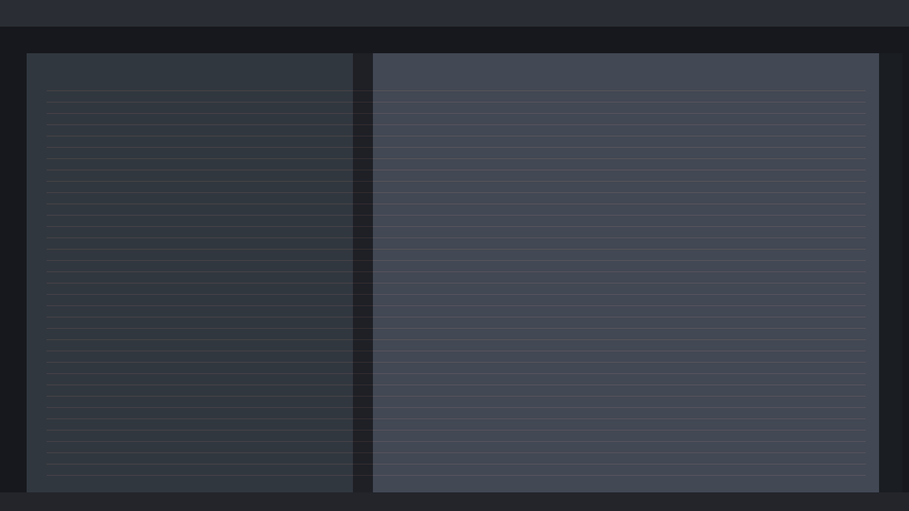
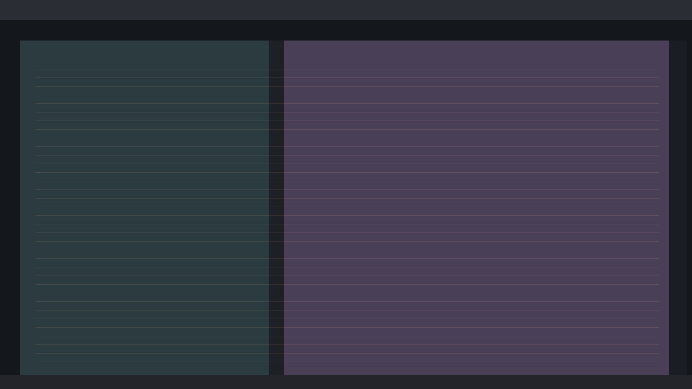
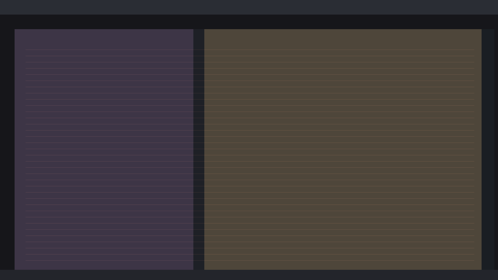
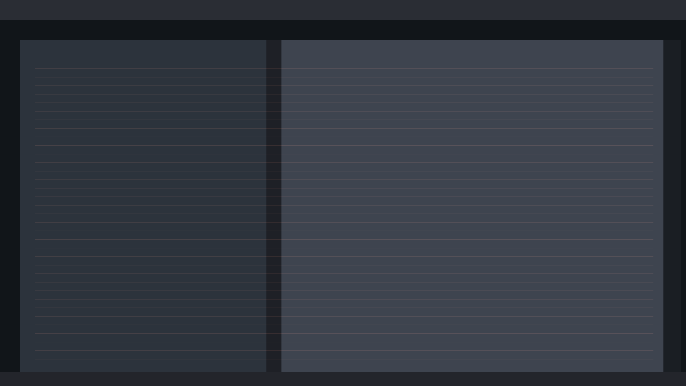
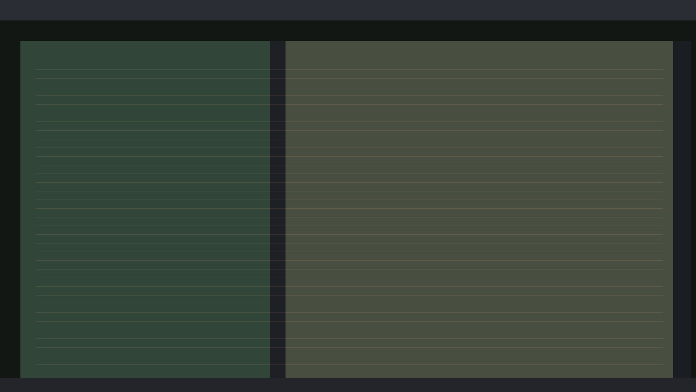
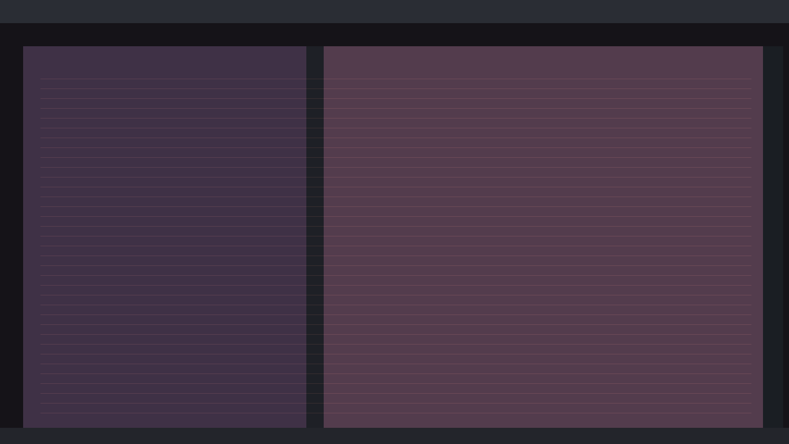
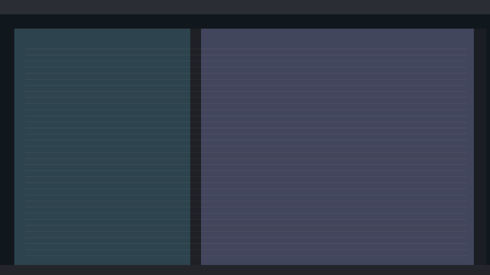
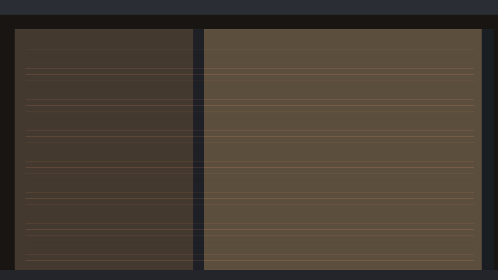

# ROPER

ROPER is a native GTK 4 desktop app for Linux focused on one job: turning rough rap fragments into finished lyrics without leaving your local machine.

This documentation covers:

- practical writing workflows
- how highlighting works (and why it matters)
- minimap behavior on long tracks
- ideas workspace flow
- packaging and local data layout
- demo content + screenshots included in this repository

---

## What ROPER is built for

ROPER works best when you write in two phases:

1. **Raw pane** (left): free-form material, fragments, alternates, punchline variants.
2. **Final pane** (right): structured song with sections and sequence.

You can keep massive drafts and still navigate fast thanks to:

- live repeat highlighting
- structure highlighting (`[INTRO]`, `[VERSE 1]`, `[HOOK]`, `[OUTRO]`, ...)
- minimap + viewport indicator for long text
- line-indexed raw gutter actions

---

## Screenshot gallery (8)

> Generated showcase images are stored in `docs/screenshots/`.

### 1) Main split editor



### 2) Long-form draft with minimap



### 3) Live highlight density (final pane focus)



### 4) Raw material shaping pass



### 5) Ideas workspace and pane segmentation



### 6) Artist and track organization



### 7) Transfer and refinement loop



### 8) Session completion / final pass



---

## Core workflow patterns

### Workflow A: from blank page to structured draft

1. Create/select artist and track.
2. Dump ideas in the **raw pane** rapidly.
3. Promote lines into **final pane** and add structure tags:
	- `[INTRO]`
	- `[VERSE 1]`, `[VERSE 2]`, ...
	- `[HOOK]` or `[HOOK 1]`, `[HOOK 2]`
	- `[OUTRO]`
4. Use highlight feedback to reduce repetitive weak spots.
5. Use minimap to jump large sections quickly.

### Workflow B: raw-to-final iterative polishing

1. Keep alternates in raw lines.
2. Mark and transfer only the strongest material.
3. Let repeat heatmap expose overused words in the final pane.
4. Rewrite while preserving cadence and structure.

### Workflow C: ideas-first writing sprint

1. Open Ideas workspace.
2. Fill all three panes:
	- **IN/OUT** (framing, entry/exit, intro/outro language)
	- **VERSES** (technical bars and progression)
	- **HOOKS/BRIDGES** (anchors and transitions)
3. Transfer selected idea content into a target track.
4. Continue arrangement and cleanup in the split editor.

---

## How highlighting works (important)

ROPER has multiple highlight channels that support decision-making while writing.

### 1) Raw chain highlights (orange, left pane)

- ROPER tokenizes words from both panes.
- If a word appears in final text, matching spans in raw are marked in orange.
- This gives immediate visual feedback on what source material is already represented.

Practical use:

- avoid reusing the same pool blindly
- quickly see untouched raw clusters worth mining

### 2) Final repeat heatmap (red intensity, right pane)

- Repeated words in final pane are shaded with increasing red intensity.
- Nearby repetitions receive stronger buckets than distant repetitions.

Bucket behavior (conceptual):

- very close repeats -> hottest red
- medium distance repeats -> medium red
- far repeats -> lighter red

Practical use:

- keep hooks intentional while reducing accidental repetition
- spot lazy fallback words in dense sections

### 3) Warning markers (skull icons)

- Dense repetition zones in final text produce warning icons.
- They are drawn near line ends or inline when space allows.
- In current UI behavior, warnings are rendered as skull markers for visibility.

Practical use:

- quickly inspect high-risk lines for monotony
- force rewrite passes where lexical variety collapses

### 4) Structure highlights (section-colored ranges)

Detected tags color full regions until the next tag:

- `[INTRO]`
- `[VERSE n]`
- `[HOOK]` / `[HOOK n]`
- `[OUTRO]`

Practical use:

- maintain structural readability in long tracks
- reduce accidental section bleed

### 5) Minimap + section badges (for long text)

- Minimap appears when pane content exceeds line threshold.
- It visualizes line density and structure blocks.
- Viewport rectangle shows what part is currently visible.
- Clicking/dragging minimap scrolls directly.

Practical use:

- jump from early verse to late bridge instantly
- keep orientation in 200+ line drafts

---

## Built-in showcase dataset

Repository includes a generator that populates real app storage with heavy demo content:

- **3 artists**
- **6 tracks** (2 per artist)
- each track has **200+ lines** in Romanian in both raw/final states
- populated **used-material** markers for gutter features
- **3 ideas** with substantial text in all three idea panes
- generated artist images + track artwork
- generated screenshot set (8 files)

### Generate/populate showcase data

Run:

```bash
python3 scripts/populate_showcase_data.py
```

Default storage target:

- `~/.local/share/roper`

Override target root if needed:

```bash
ROPER_STORAGE_DIR=/absolute/path/to/roper-data python3 scripts/populate_showcase_data.py
```

---

## Keyboard shortcuts

- `Ctrl+Z`: Undo
- `Ctrl+Shift+Z` / `Ctrl+Y`: Redo
- `Ctrl+C`, `Ctrl+X`, `Ctrl+V`: Copy / Cut / Paste
- `Ctrl+A`: Select all in active editor
- `Ctrl+Enter`: Transfer active raw line
- `Ctrl+F`: Search
- `Ctrl+L`: Focus final pane
- `Ctrl+R`: Focus raw pane
- `Escape`: Close active search/overlay/panel
- `F11`: Reassert fullscreen

---

## Development setup

On Debian Trixie:

```bash
sudo apt-get install rustc cargo libgtk-4-dev pkg-config
```

Optional tooling:

```bash
sudo apt-get install rustfmt rust-clippy
```

### Build and test

```bash
cargo build
cargo test
cargo clippy --all-targets --all-features
```

Run locally:

```bash
cargo run
```

---

## Debian package workflow

Build package:

```bash
./packaging/build-deb.sh
```

Validate package:

```bash
./packaging/validate-package.sh
```

Install local build:

```bash
sudo apt install ./dist/roper_*_amd64.deb
```

Remove again:

```bash
sudo apt remove roper
```

Generated artifact pattern:

- `dist/roper_*_amd64.deb`

---

## Installed paths (Debian package)

- Binary: `/usr/bin/roper`
- Desktop file: `/usr/share/applications/org.rmml.roper.desktop`
- AppStream metadata: `/usr/share/metainfo/org.rmml.roper.metainfo.xml`
- Icons: `/usr/share/icons/hicolor/`
- Runtime app assets: `/usr/share/roper/`

---

## Local data model

ROPER stores writable runtime state in one root:

- `~/.local/share/roper`

Important subpaths:

- `artists/` (artist metadata files)
- `artist_images/` (artist image files)
- `tracks/<track-id>/settings.json`
- `tracks/<track-id>/lyrics/final.txt`
- `tracks/<track-id>/lyrics/raw.txt`
- `ideas/<idea-id>/settings.json`
- `ideas/<idea-id>/{in_out,verses,hooks_bridges}.txt`
- `roper.log`

---

## Privacy model

ROPER is designed for local/offline usage and does not require cloud accounts or hosted runtime services.

---

## License

ROPER is released under **The Unlicense**.
See `LICENSE` for full text.
